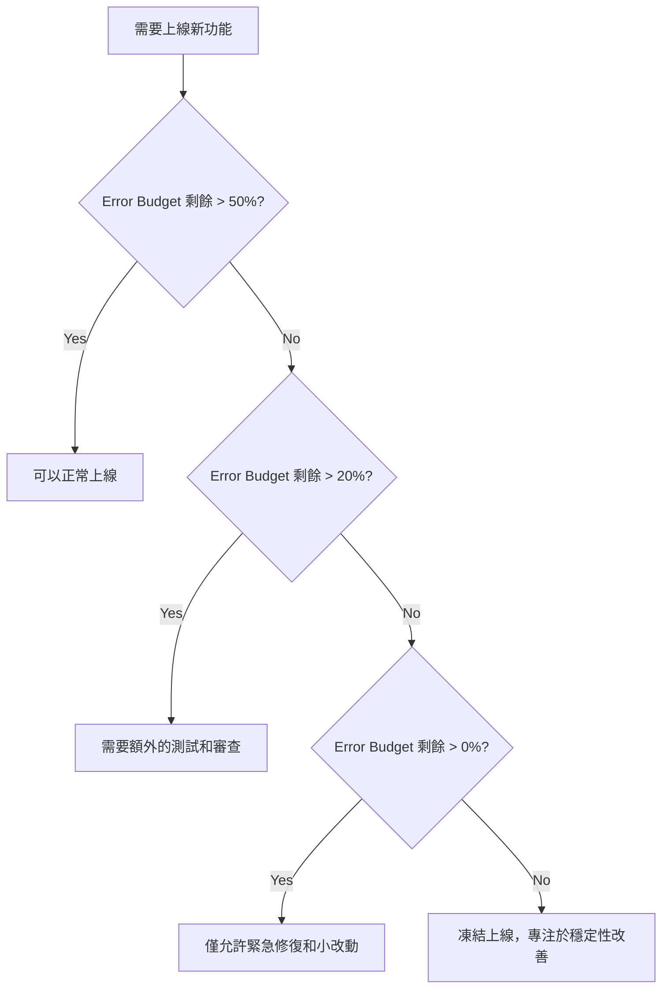

「我們要不要上線這個新功能？」

「目前 Error Budget 還剩 30%，可以上。」

**Error Budget** 把「穩定性」從抽象的概念，變成可以量化的決策依據。

## Error Budget 是什麼？

Error Budget = **允許的錯誤次數**

公式：

```
Error Budget = 1 - SLO
```

舉例：

- SLO = 99.9%（三個九）
- Error Budget = 0.1%
- 一個月（30 天）允許的 downtime = **43.2 分鐘**

## 為什麼需要 Error Budget？

### 傳統思維：穩定性 vs 速度

- **SRE 團隊**：「我們需要更穩定的系統，不要再亂上新功能了！」
- **產品團隊**：「我們需要快速迭代，不要再阻擋我們了！」

### Error Budget 思維：量化的決策

- **Error Budget 充足**：可以快速上線新功能
- **Error Budget 用盡**：暫停上線，專注於穩定性改善

## 計算 Error Budget

> **關於 SLI 的詳細計算公式**：請參考《Week 46: SLI、SLO、SLA》文章。

本文專注於如何使用 Error Budget 做決策。

### 1. 基於可用性的 Error Budget

**目標**：99.9% 可用性（三個九）

```promql
# 記錄規則：計算剩餘 Error Budget
- record: service:error_budget_remaining:ratio
  expr: |
    max(0, 1 - (
      (1 - sum(rate(http_requests_total{status=~"2..|3.."}[30d])) / sum(rate(http_requests_total[30d])))
      / (1 - 0.999)
    ))
```

### 2. 基於延遲的 Error Budget

**目標**：P95 延遲 < 500ms

```promql
# 記錄規則：計算延遲 Error Budget 剩餘
- record: service:latency_error_budget_remaining:ratio
  expr: |
    max(0, 1 - (
      (1 - sum(rate(http_request_duration_seconds_bucket{le="0.5"}[30d])) / sum(rate(http_request_duration_seconds_count[30d])))
      / (1 - 0.95)
    ))
```

### 3. 基於錯誤率的 Error Budget

**目標**：錯誤率 < 0.1%

```promql
# 記錄規則：計算錯誤率 Error Budget 剩餘
- record: service:error_rate_budget_remaining:ratio
  expr: |
    max(0, 1 - (
      (sum(rate(http_requests_total{status=~"5.."}[30d])) / sum(rate(http_requests_total[30d])))
      / 0.001
    ))
```

## Grafana Dashboard

### Error Budget Dashboard

```json
{
  "dashboard": {
    "title": "Error Budget Dashboard",
    "panels": [
      {
        "title": "Error Budget Remaining",
        "targets": [
          {
            "expr": "service:error_budget_remaining:ratio * 100"
          }
        ],
        "type": "gauge",
        "options": {
          "thresholds": {
            "steps": [
              { "value": 0, "color": "red" },
              { "value": 20, "color": "yellow" },
              { "value": 50, "color": "green" }
            ]
          }
        }
      },
      {
        "title": "Error Budget Burn Rate (7d)",
        "targets": [
          {
            "expr": "sum(rate(http_requests_total{status=~\"5..\"}[7d])) / sum(rate(http_requests_total[7d])) / (1 - 0.999) * 100"
          }
        ],
        "type": "graph"
      },
      {
        "title": "Availability (30d)",
        "targets": [
          {
            "expr": "service:availability:ratio * 100"
          }
        ],
        "type": "graph"
      }
    ]
  }
}
```

## Error Budget 決策框架

### 決策樹



### 決策表

| Error Budget 剩餘 | 動作 | 審查流程 |
|-------------------|------|----------|
| > 50% | 正常上線 | 標準審查 |
| 20-50% | 謹慎上線 | 加強測試 + 技術 Lead 審查 |
| 0-20% | 僅緊急修復 | 技術 Lead + SRE Lead 審查 |
| < 0% | 凍結上線 | 需要 CTO 批准 |

## 實戰：Error Budget Policy

### Policy 文件

```markdown
# Error Budget Policy

## 1. 目標

維持 99.9% 的可用性（三個九）

## 2. Error Budget

- **時間窗口**：30 天
- **允許的 downtime**：43.2 分鐘/月
- **計算方式**：基於 HTTP 5xx 錯誤率

## 3. 決策規則

### Error Budget > 50%
- ✅ 可以正常上線新功能
- ✅ 可以進行架構調整
- ✅ 可以進行效能實驗

### Error Budget 20-50%
- ⚠️ 需要額外的測試
- ⚠️ 需要技術 Lead 審查
- ⚠️ 建議使用 Feature Flag

### Error Budget 0-20%
- 🚫 僅允許 Bug 修復
- 🚫 僅允許安全性修復
- 🚫 需要 SRE Lead 審查

### Error Budget < 0%
- 🔴 凍結所有上線
- 🔴 成立事故小組
- 🔴 每日檢討會議
- 🔴 需要 CTO 批准才能上線

## 4. Error Budget 恢復計畫

當 Error Budget < 0% 時：

1. **停止所有新功能上線**
2. **分析問題根因**
3. **建立改善計畫**
4. **每日檢討進度**
5. **當 Error Budget > 20% 時，恢復正常流程**

## 5. 例外處理

以下情況可以申請例外：

- **安全性緊急修復**
- **法律合規要求**
- **重大商業機會**

需要通過 CTO 批准。
```

## 自動化 Error Budget 監控

### Prometheus 告警規則

```yaml
groups:
  - name: error_budget
    interval: 5m
    rules:
      # Error Budget 警告（剩餘 < 20%）
      - alert: ErrorBudgetLow
        expr: service:error_budget_remaining:ratio < 0.2
        for: 5m
        labels:
          severity: warning
        annotations:
          summary: "Error Budget 剩餘不足 20%"
          description: "服務 {{ $labels.service }} 的 Error Budget 僅剩 {{ $value | humanizePercentage }}，需要謹慎上線"
          dashboard: "https://grafana/d/error-budget"
          action: "加強測試，需要技術 Lead 審查"

      # Error Budget 嚴重（剩餘 < 5%）
      - alert: ErrorBudgetCritical
        expr: service:error_budget_remaining:ratio < 0.05
        for: 5m
        labels:
          severity: critical
        annotations:
          summary: "Error Budget 即將用盡"
          description: "服務 {{ $labels.service }} 的 Error Budget 僅剩 {{ $value | humanizePercentage }}，僅允許緊急修復"
          dashboard: "https://grafana/d/error-budget"
          action: "凍結上線，成立事故小組"

      # Error Budget 用盡
      - alert: ErrorBudgetExhausted
        expr: service:error_budget_remaining:ratio <= 0
        for: 5m
        labels:
          severity: critical
        annotations:
          summary: "Error Budget 已用盡"
          description: "服務 {{ $labels.service }} 的 Error Budget 已用盡，凍結所有上線"
          dashboard: "https://grafana/d/error-budget"
          action: "凍結上線，需要 CTO 批准才能恢復"
```

## Java 實作：Error Budget 檢查

### Spring Boot Filter

```java
@Component
@Order(1)
public class ErrorBudgetFilter extends OncePerRequestFilter {

    @Value("${error-budget.threshold:0.2}")
    private double errorBudgetThreshold;

    private final MeterRegistry meterRegistry;
    private final ErrorBudgetService errorBudgetService;

    public ErrorBudgetFilter(MeterRegistry meterRegistry, 
                             ErrorBudgetService errorBudgetService) {
        this.meterRegistry = meterRegistry;
        this.errorBudgetService = errorBudgetService;
    }

    @Override
    protected void doFilterInternal(HttpServletRequest request,
                                    HttpServletResponse response,
                                    FilterChain filterChain) throws ServletException, IOException {
        
        // 檢查 Error Budget
        double remaining = errorBudgetService.getErrorBudgetRemaining();
        
        // 記錄 Error Budget 剩餘量
        meterRegistry.gauge("error_budget_remaining", remaining);
        
        // 如果 Error Budget 用盡，且不是緊急修復
        if (remaining <= 0 && !isEmergencyFix(request)) {
            response.setStatus(503); // Service Unavailable
            response.setHeader("X-Error-Budget-Exhausted", "true");
            response.setHeader("Retry-After", "3600"); // 1 hour
            
            response.getWriter().write(
                "Service is in Error Budget recovery mode. " +
                "Only emergency fixes are allowed."
            );
            return;
        }
        
        // 如果 Error Budget 不足，加入 Warning Header
        if (remaining < errorBudgetThreshold) {
            response.setHeader("X-Error-Budget-Low", String.valueOf(remaining));
        }
        
        filterChain.doFilter(request, response);
    }

    private boolean isEmergencyFix(HttpServletRequest request) {
        String emergencyHeader = request.getHeader("X-Emergency-Fix");
        return "true".equals(emergencyHeader);
    }
}
```

### Error Budget Service

```java
@Service
public class ErrorBudgetService {

    private final PrometheusService prometheusService;

    public ErrorBudgetService(PrometheusService prometheusService) {
        this.prometheusService = prometheusService;
    }

    /**
     * 取得 Error Budget 剩餘量
     */
    public double getErrorBudgetRemaining() {
        String query = "service:error_budget_remaining:ratio";
        return prometheusService.query(query);
    }

    /**
     * 取得 Error Budget 消耗速率（Burn Rate）
     */
    public double getErrorBudgetBurnRate(String window) {
        String query = String.format(
            "sum(rate(http_requests_total{status=~\"5..\"}[%s])) / " +
            "sum(rate(http_requests_total[%s])) / (1 - 0.999)",
            window, window
        );
        return prometheusService.query(query);
    }

    /**
     * 取得允許的上線次數
     */
    public int getAllowedDeployments() {
        double remaining = getErrorBudgetRemaining();
        
        if (remaining > 0.5) {
            return Integer.MAX_VALUE; // 無限制
        } else if (remaining > 0.2) {
            return 5; // 每天最多 5 次
        } else if (remaining > 0) {
            return 1; // 每天最多 1 次（僅緊急修復）
        } else {
            return 0; // 凍結上線
        }
    }
}
```

## .NET 實作：Error Budget Middleware

```csharp
public class ErrorBudgetMiddleware
{
    private readonly RequestDelegate _next;
    private readonly IErrorBudgetService _errorBudgetService;
    private readonly ILogger<ErrorBudgetMiddleware> _logger;
    private readonly double _errorBudgetThreshold;

    public ErrorBudgetMiddleware(
        RequestDelegate next,
        IErrorBudgetService errorBudgetService,
        ILogger<ErrorBudgetMiddleware> logger,
        IConfiguration configuration)
    {
        _next = next;
        _errorBudgetService = errorBudgetService;
        _logger = logger;
        _errorBudgetThreshold = configuration.GetValue<double>("ErrorBudget:Threshold", 0.2);
    }

    public async Task InvokeAsync(HttpContext context)
    {
        // 檢查 Error Budget
        var remaining = await _errorBudgetService.GetErrorBudgetRemainingAsync();

        // 記錄 Metric
        ErrorBudgetMetrics.Remaining.Set(remaining);

        // Error Budget 用盡
        if (remaining <= 0 && !IsEmergencyFix(context.Request))
        {
            context.Response.StatusCode = 503;
            context.Response.Headers.Add("X-Error-Budget-Exhausted", "true");
            context.Response.Headers.Add("Retry-After", "3600");

            await context.Response.WriteAsJsonAsync(new
            {
                Error = "Service is in Error Budget recovery mode",
                Message = "Only emergency fixes are allowed",
                ErrorBudgetRemaining = remaining
            });

            _logger.LogWarning(
                "Request blocked due to Error Budget exhausted. Path: {Path}",
                context.Request.Path);

            return;
        }

        // Error Budget 不足警告
        if (remaining < _errorBudgetThreshold)
        {
            context.Response.Headers.Add("X-Error-Budget-Low", remaining.ToString("F4"));
            
            _logger.LogWarning(
                "Error Budget is low: {Remaining:P2}. Path: {Path}",
                remaining,
                context.Request.Path);
        }

        await _next(context);
    }

    private bool IsEmergencyFix(HttpRequest request)
    {
        return request.Headers.TryGetValue("X-Emergency-Fix", out var value) 
               && value == "true";
    }
}

public interface IErrorBudgetService
{
    Task<double> GetErrorBudgetRemainingAsync();
    Task<double> GetErrorBudgetBurnRateAsync(string window);
    Task<int> GetAllowedDeploymentsAsync();
}

public class ErrorBudgetService : IErrorBudgetService
{
    private readonly IPrometheusService _prometheusService;

    public ErrorBudgetService(IPrometheusService prometheusService)
    {
        _prometheusService = prometheusService;
    }

    public async Task<double> GetErrorBudgetRemainingAsync()
    {
        var query = "service:error_budget_remaining:ratio";
        return await _prometheusService.QueryAsync(query);
    }

    public async Task<double> GetErrorBudgetBurnRateAsync(string window)
    {
        var query = $@"
            sum(rate(http_requests_total{{status=~""5..""}}[{window}])) /
            sum(rate(http_requests_total[{window}])) / (1 - 0.999)";
        
        return await _prometheusService.QueryAsync(query);
    }

    public async Task<int> GetAllowedDeploymentsAsync()
    {
        var remaining = await GetErrorBudgetRemainingAsync();

        return remaining switch
        {
            > 0.5 => int.MaxValue,
            > 0.2 => 5,
            > 0 => 1,
            _ => 0
        };
    }
}
```

## CI/CD 整合

### GitLab CI

```yaml
stages:
  - test
  - check-error-budget
  - deploy

check-error-budget:
  stage: check-error-budget
  script:
    - |
      REMAINING=$(curl -s "http://prometheus:9090/api/v1/query?query=service:error_budget_remaining:ratio" | jq -r '.data.result[0].value[1]')
      echo "Error Budget Remaining: $REMAINING"
      
      if (( $(echo "$REMAINING < 0" | bc -l) )); then
        echo "Error Budget exhausted! Deployment blocked."
        exit 1
      elif (( $(echo "$REMAINING < 0.2" | bc -l) )); then
        echo "Error Budget low! Requires manual approval."
        exit 0
      else
        echo "Error Budget sufficient. Proceeding with deployment."
      fi
  only:
    - main

deploy:
  stage: deploy
  script:
    - kubectl apply -f k8s/
  when: manual
  only:
    - main
```

---

**Error Budget 讓「穩定性」不再是模糊的概念，而是可以量化的決策依據。**

當你有明確的 Error Budget Policy，團隊可以在速度與穩定性之間找到最佳平衡點。
