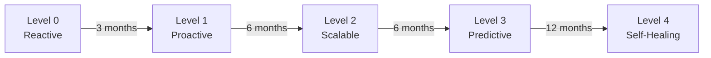

「我們的 Observability 做得夠好了嗎？」

這個問題很難回答，因為「好」是相對的。

**Observability Maturity Model** 可以幫助你：
- 評估目前團隊的成熟度
- 找出需要改進的地方
- 制定改善計畫

## Observability Maturity Model

我們把 Observability 成熟度分為 **5 個階段**：

| 階段 | 名稱 | 特徵 |
|------|------|------|
| Level 0 | **Reactive** | 使用者回報才知道有問題 |
| Level 1 | **Proactive** | 有基本監控，但缺乏整合 |
| Level 2 | **Scalable** | 有完整的監控系統，可擴展 |
| Level 3 | **Predictive** | 可以預測問題，自動化程度高 |
| Level 4 | **Self-Healing** | 系統可以自我修復 |

## Level 0: Reactive（反應式）

### 特徵

❌ **沒有監控系統**
- 依賴使用者回報問題
- 沒有 Logs 集中管理
- 沒有 Metrics 收集
- 沒有 Distributed Tracing

❌ **事後處理**
- 只有在問題發生後才知道
- MTTR（平均修復時間）很長
- 無法追蹤問題根因

❌ **沒有 SLO**
- 不知道服務的可用性
- 沒有 Error Budget 概念

### 典型情況

```
使用者：「我無法下單！」
客服：「我們會盡快處理...」
工程師：「我們來查一下 Log... 咦？Log 在哪裡？」
```

### 改善建議

1. **建立基本監控**
   - 安裝 Prometheus + Grafana
   - 開始收集基本 Metrics（CPU, Memory, Request Rate）

2. **集中管理 Logs**
   - 安裝 ELK Stack 或 Loki
   - 開始收集應用程式 Logs

3. **定義基本 SLI**
   - 可用性、延遲、錯誤率

## Level 1: Proactive（主動式）

### 特徵

✅ **有基本監控**
- 有 Metrics 收集（Prometheus）
- 有 Logs 集中管理（ELK）
- 有基本的 Dashboard（Grafana）

✅ **有告警**
- 可以在問題發生時收到通知
- 但告警規則不完整，常有誤報

⚠️ **缺乏整合**
- Metrics、Logs、Traces 各自獨立
- 需要手動在多個系統間切換
- 難以快速定位問題

⚠️ **手動處理**
- 大部分操作都是手動的
- 沒有自動化

### 典型情況

```
AlertManager：「Order Service High Error Rate！」
工程師：「我來查一下 Grafana... 錯誤率確實很高」
工程師：「再查一下 Kibana... 找到錯誤日誌了」
工程師：「手動重啟服務...」
```

### 改善建議

1. **整合 Observability 工具**
   - 安裝 OpenTelemetry
   - 整合 Metrics、Logs、Traces

2. **改善告警規則**
   - 使用 Multi-window Burn Rate
   - 減少誤報

3. **建立 Runbook**
   - 標準化處理流程

4. **定義 SLO**
   - 建立 Error Budget

## Level 2: Scalable（可擴展）

### 特徵

✅ **完整的監控系統**
- 有 Metrics、Logs、Traces 整合
- 有 Distributed Tracing（Jaeger/Zipkin）
- 有 Service Mesh（Istio/Linkerd）

✅ **有效的告警**
- 告警規則完善，很少誤報
- 有 On-Call 輪值制度
- 有 PagerDuty 整合

✅ **標準化流程**
- 有 Runbook
- 有 SLO 和 Error Budget
- 有 Postmortem 流程

✅ **部分自動化**
- 有 CI/CD 整合
- 有自動化部署
- 有基本的自動恢復機制

### 典型情況

```
AlertManager：「Order Service High Error Rate！」
工程師：「查看 Grafana Dashboard... 錯誤率上升」
工程師：「點擊 Trace ID 連結，跳轉到 Jaeger... 找到慢查詢」
工程師：「按照 Runbook 執行... 重啟服務」
工程師：「建立 Postmortem，記錄問題」
```

### 改善建議

1. **加入預測性監控**
   - 使用 Anomaly Detection
   - 建立 Capacity Planning

2. **增加自動化**
   - 自動化常見的處理流程
   - 使用 Ansible/Terraform

3. **改善 Error Budget**
   - 自動化 Error Budget 檢查
   - 整合到 CI/CD

## Level 3: Predictive（預測式）

### 特徵

✅ **智能監控**
- 有 Anomaly Detection（異常偵測）
- 有 Trend Analysis（趨勢分析）
- 可以預測問題發生

✅ **高度自動化**
- 大部分操作都是自動化的
- 有 Auto-scaling
- 有 Circuit Breaker
- 有 Chaos Engineering

✅ **完整的 SRE 實踐**
- 有 Error Budget Policy
- 有 Blameless Postmortem
- 有定期檢討會議

✅ **業務整合**
- 監控與業務指標結合
- 可以追蹤功能發布的影響

### 典型情況

```
Anomaly Detection System：「偵測到 Database Connection Pool 使用率異常上升」
Auto-scaling System：「自動擴展 Order Service 副本數」
Circuit Breaker：「偵測到第三方 API 失敗率過高，啟用降級模式」
工程師：「收到預測性告警，提前處理潛在問題」
```

### 改善建議

1. **建立 Self-Healing 機制**
   - 自動修復常見問題
   - 減少人工介入

2. **加入 AI/ML**
   - 使用機器學習預測容量需求
   - 自動調整資源

## Level 4: Self-Healing（自我修復）

### 特徵

✅ **完全自動化**
- 系統可以自我診斷
- 系統可以自我修復
- 人工介入降到最低

✅ **AI 驅動**
- 使用 AI/ML 預測問題
- 自動產生解決方案
- 持續學習和改進

✅ **業務優先**
- 監控直接對應業務價值
- 自動優化資源分配
- 持續改進業務 KPI

### 典型情況

```
Self-Healing System：「偵測到 Order Service 記憶體洩漏」
Self-Healing System：「分析 Heap Dump，找到記憶體洩漏的 Class」
Self-Healing System：「自動建立 Jira Ticket，分配給相關團隊」
Self-Healing System：「臨時增加 Memory Limit，並重啟服務」
Self-Healing System：「問題已解決，使用者沒有感受到影響」
```

### 特色

- Google SRE 的目標
- 需要大量投資和時間
- 適合大型組織

## Maturity Assessment

### 評估問卷

| 領域 | Level 0 | Level 1 | Level 2 | Level 3 | Level 4 |
|------|---------|---------|---------|---------|---------|
| **Metrics** | ❌ 無 | ⚠️ 基本 | ✅ 完整 | ✅ 預測 | ✅ AI 驅動 |
| **Logs** | ❌ 無 | ⚠️ 分散 | ✅ 集中 | ✅ 整合 | ✅ 智能分析 |
| **Traces** | ❌ 無 | ❌ 無 | ✅ 有 | ✅ 完整 | ✅ AI 驅動 |
| **Alerts** | ❌ 無 | ⚠️ 誤報多 | ✅ 有效 | ✅ 預測性 | ✅ 自動處理 |
| **SLO** | ❌ 無 | ⚠️ 基本 | ✅ 完整 | ✅ 自動化 | ✅ 業務整合 |
| **Automation** | ❌ 無 | ⚠️ 少量 | ⚠️ 部分 | ✅ 高度 | ✅ 完全 |
| **Runbook** | ❌ 無 | ⚠️ 不完整 | ✅ 有 | ✅ 自動化 | ✅ 自我修復 |
| **Postmortem** | ❌ 無 | ⚠️ 偶爾 | ✅ 定期 | ✅ Blameless | ✅ 持續改進 |

### 評分標準

每個領域：
- Level 0 = 0 分
- Level 1 = 1 分
- Level 2 = 2 分
- Level 3 = 3 分
- Level 4 = 4 分

**總分**：8 個領域 × 4 分 = 32 分

- **0-8 分**：Level 0（Reactive）
- **9-16 分**：Level 1（Proactive）
- **17-24 分**：Level 2（Scalable）
- **25-30 分**：Level 3（Predictive）
- **31-32 分**：Level 4（Self-Healing）

## 實戰：建立改善計畫

### Step 1: 評估現況

使用評估問卷，找出目前的成熟度等級。

### Step 2: 設定目標

根據團隊大小和資源，設定合理的目標：

- **小團隊（< 10 人）**：Level 2 (Scalable)
- **中型團隊（10-50 人）**：Level 3 (Predictive)
- **大型團隊（> 50 人）**：Level 4 (Self-Healing)

### Step 3: 制定計畫

#### Q1: 基礎建設

- [ ] 安裝 Prometheus + Grafana
- [ ] 安裝 ELK Stack 或 Loki
- [ ] 安裝 OpenTelemetry
- [ ] 建立基本 Dashboard

#### Q2: 整合與自動化

- [ ] 整合 Metrics、Logs、Traces
- [ ] 建立 SLO 和 Error Budget
- [ ] 建立 Runbook
- [ ] 自動化部署流程

#### Q3: 進階功能

- [ ] 加入 Service Mesh（Istio/Linkerd）
- [ ] 建立 On-Call 輪值
- [ ] 建立 Postmortem 流程
- [ ] 整合 PagerDuty

#### Q4: 預測與自動化

- [ ] 加入 Anomaly Detection
- [ ] 建立 Auto-scaling
- [ ] 建立 Circuit Breaker
- [ ] 進行 Chaos Engineering

### Step 4: 定期檢討

每季檢討一次，評估進度和調整計畫。

## Maturity Roadmap



### 時間估計

- **Level 0 → Level 1**：3 個月
  - 建立基本監控系統
  
- **Level 1 → Level 2**：6 個月
  - 整合 Observability 工具
  - 建立標準化流程
  
- **Level 2 → Level 3**：6 個月
  - 加入預測性監控
  - 高度自動化
  
- **Level 3 → Level 4**：12 個月
  - 建立 Self-Healing 機制
  - AI/ML 整合

**總計**：約 2 年可以從 Level 0 提升到 Level 3

## 實戰建議

### 1. 不要追求完美

Level 2（Scalable）已經足夠大部分團隊使用。

### 2. 根據團隊大小調整

小團隊不需要 Level 4 的複雜度。

### 3. 逐步改善

不要一次做太多事情，專注於最重要的改善項目。

### 4. 持續學習

Observability 是一個持續改進的過程，沒有終點。

---

**Observability Maturity Model 可以幫助你評估團隊的成熟度，並制定改善計畫。**

重要的不是你在哪個階段，而是你有沒有持續改進。
